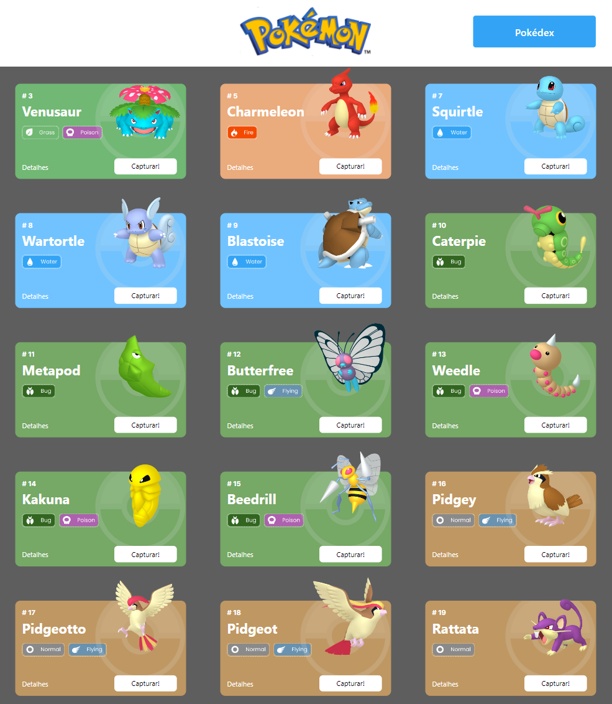
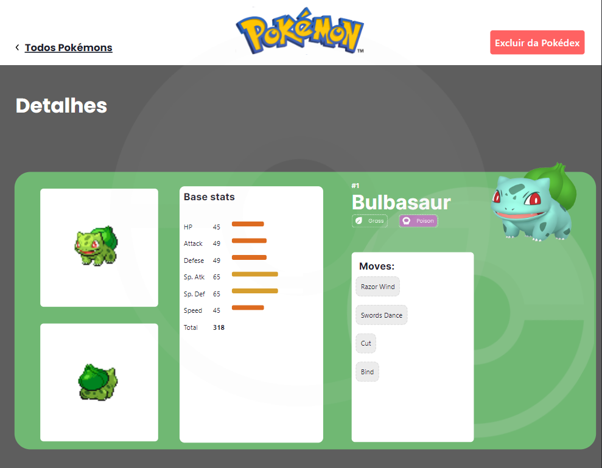
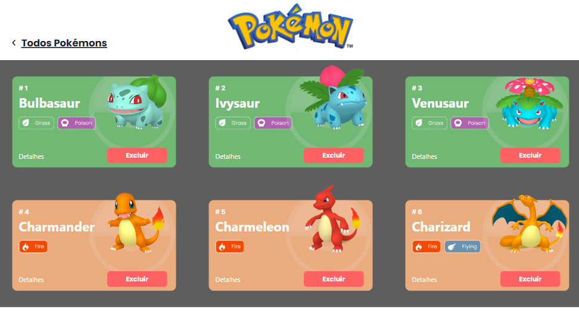
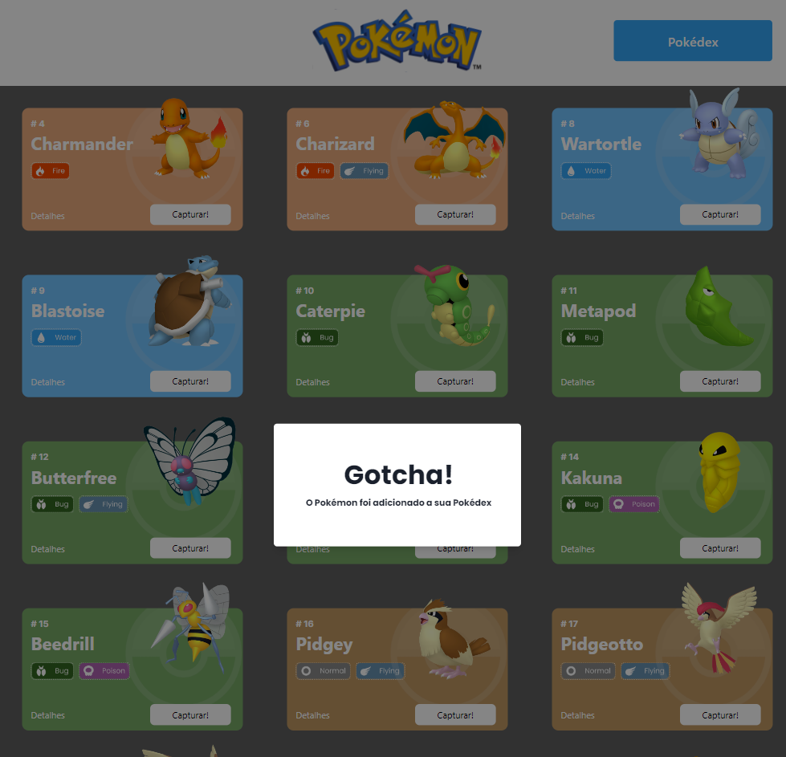
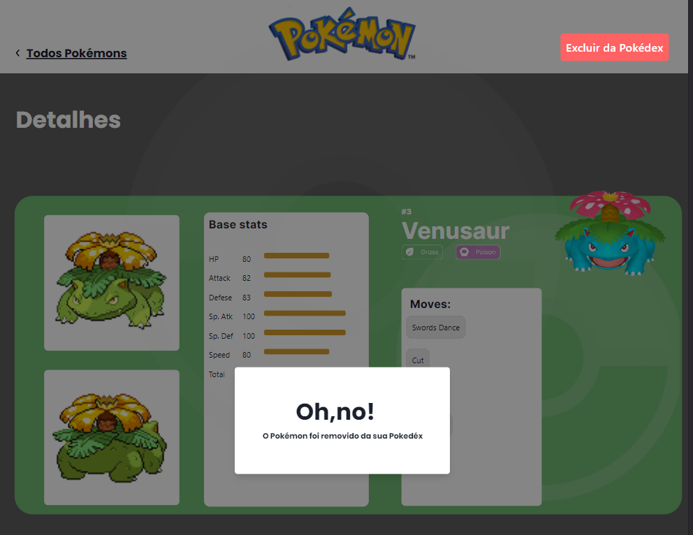
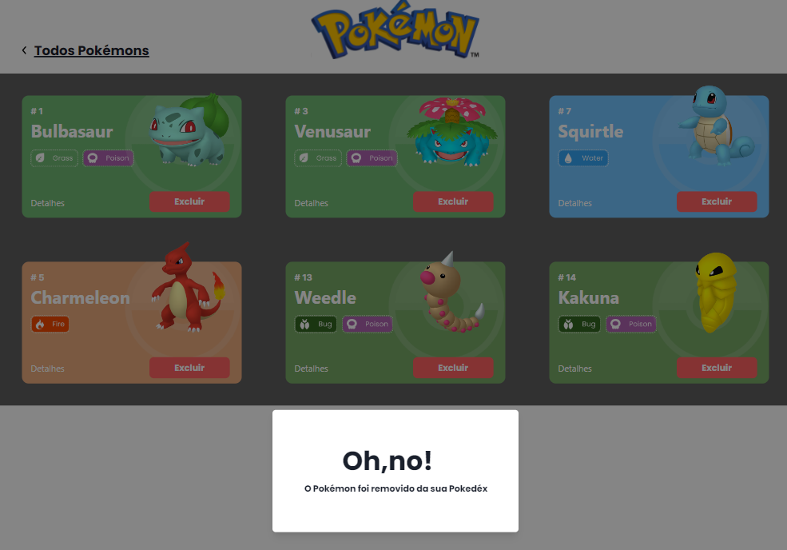
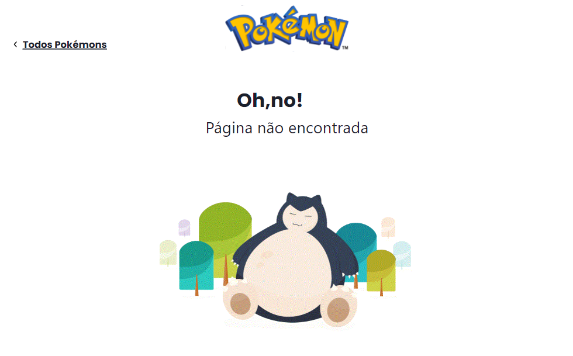

# Projeto React e API's

## Índice
> <a href="#tecnologias"> Tecnologias utilizadas</a>

> <a href="#funcionalidades"> Funcionalidades do projeto</a>

><a href="#layout"> Layout</a>

><a href="#rodar"> Como rodar este projeto?</a>

## Tecnologias utilizadas
- React
- Router
- Styled-components
- Design Systems (Chakra)
- React Context
- Estado Global
- Axios
- JavaScript
- CSS
- HTML
- Favicon

## Funcionalidades do projeto
O site tem 4 páginas, sendo:

 - **PokemonListPage** 
    - Mostra uma lista de Pokemons
   - Cada Pokemon é representado por um Card
   - Em cada card de Pokemon tem um botão para adicioná-lo à Pokedex e um outro botão para acessar os detalhes do Pokemon;
   - O Header dessa página tem um botão para acessar a página da Pokedex

 - **PokedexPage** 
    - Renderizar a lista de pokémons adicionados na pokedex;
	- Em cada card de Pokemon possui um botão para removê-lo da Pokedex e um outro botão para acessar os detalhes do Pokemon.
	- Header possui um botão para voltar para a Home
	- Não é possível adicionar o mesmo Pokemon duas vezes na Pokedex

- **PokemonDetailPage** 
	- Mostra os detalhes do Pokemon selecionado, com informações descritas
	- Header possui um botão para adicionar ou remover da Pokedex e outro para voltar a página home.

- **notFoundPage** 
 - Mostra uma imagem de um pokemon e a mensagem "Oh,no! Página não encontrada". Aprensentado também ao usuário para retornar a página principal (pokemonListPage).
 

##  Como rodar este projeto?
-  Crie um fork deste projeto.
-  Clone sua PRÓPRIA versão do repositório

Assim que baixar o projeto em seu computador, abre-o com o VSCode e execute os seguintes comandos:

npm install 

npm install axios 

npm install styled-components 

npm install react-router-dom 

npm i @chakra-ui/react @emotion/react @emotion/styled framer-motion 

npm run start 

## Layout
Pokelist Page

Pokemon Detail Page

Pokedex

Capture Pokemon

Delete Pokemon Of Pokedex From Detail Page

Delete Pokemon From Pokedex

Page Dont Found

